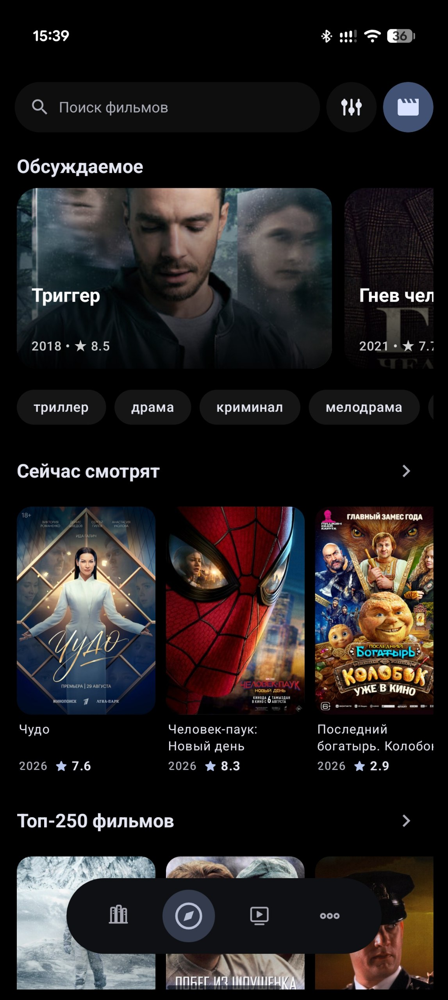
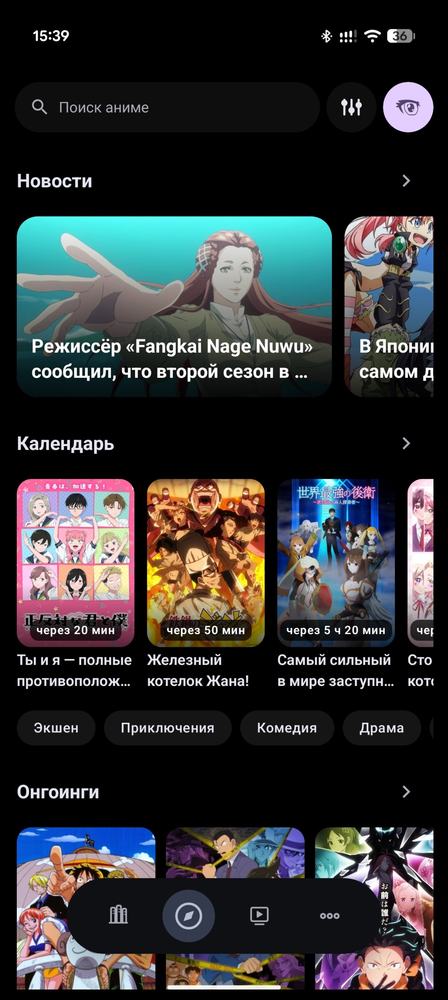
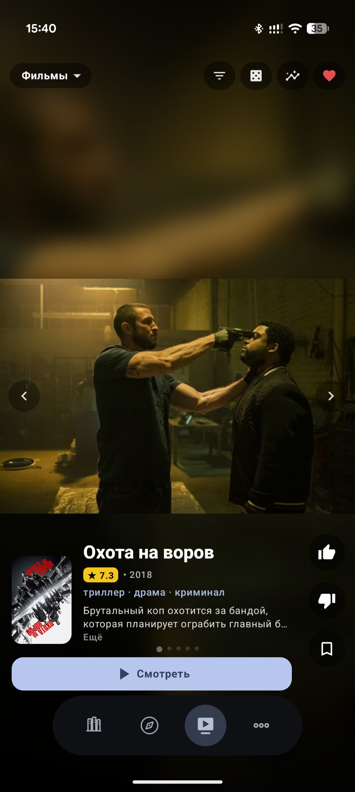
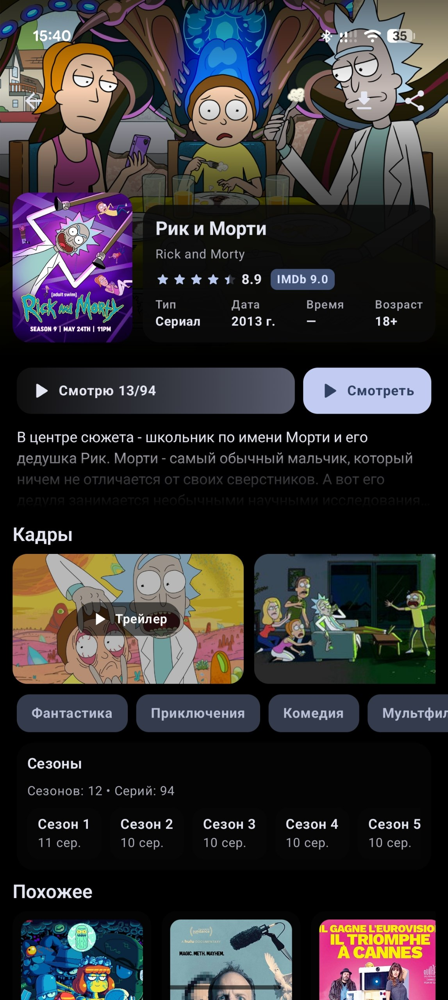
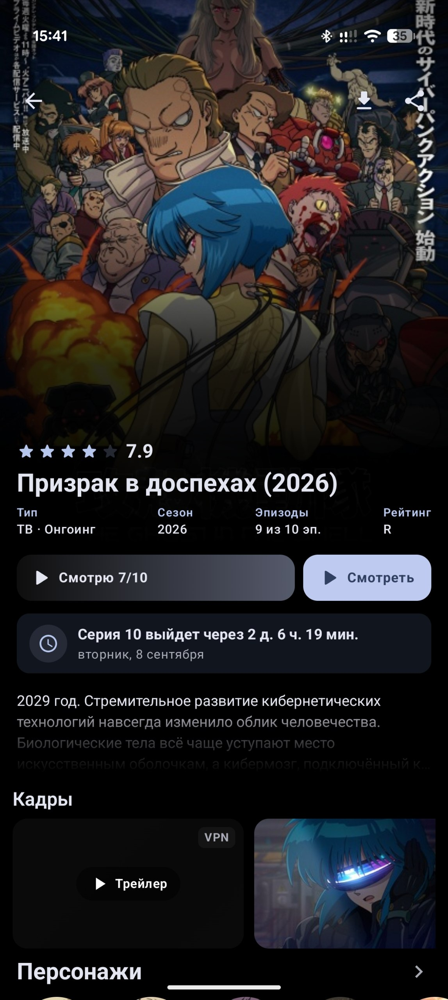
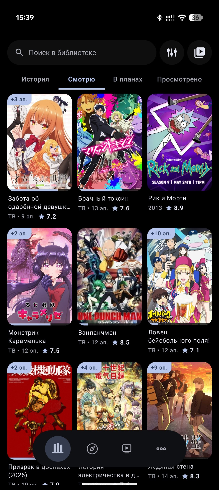
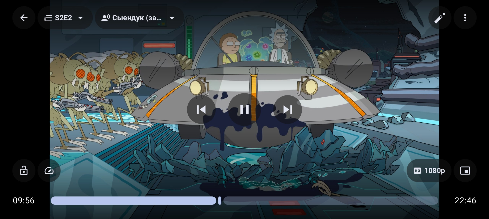
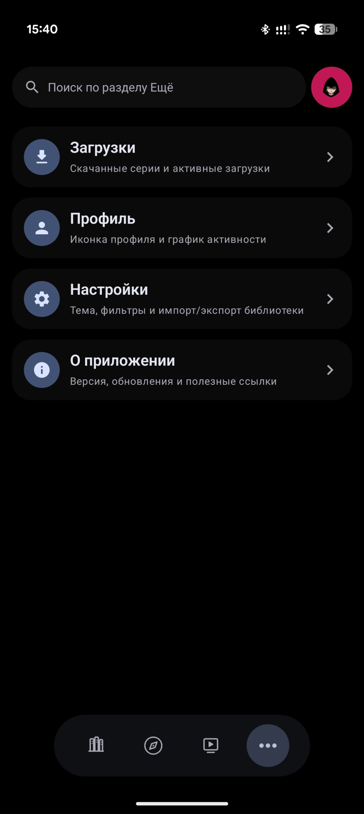

# Киношка

Фильмы, сериалы и аниме в одном приложении: каталог, библиотека, подробности о тайтлах и удобный просмотр.

Telegram-канал: <a href="https://t.me/Kinoshka_HalfDay">t.me/Kinoshka_HalfDay</a> — новые версии и обсуждение

## Каталог

**Фильмы:** обсуждаемое, «Сейчас смотрят», топ-250, подборки по жанрам. Поиск, фильтры, случайный выбор и карточки с годом и рейтингом.

**Аниме:** новости, календарь выхода эпизодов с обратным отсчётом, онгоинги и подборки по жанрам.

**Быстрый выбор:** листайте рекомендации и сразу переходите к просмотру.

## Карточка тайтла

Всё важное в одном месте: рейтинг, год, жанры, описание, кадры, трейлер, сезоны и эпизоды, персонажи и похожее.

 

Для онгоингов видно, сколько эпизодов уже вышло и когда выйдет следующий.

## Библиотека

Ведите личную коллекцию: статусы «Смотрю», «В планах», «Просмотрено» и другие, прогресс по эпизодам, история просмотра.

Бейджи вроде «+3 эп.» подскажут, что вышли новые серии.

## Просмотр

Плеер с выбором серии, озвучки и качества вплоть до 1080p. Для сериалов и аниме легко переключаться между эпизодами прямо во время просмотра.

## Ещё

- **Загрузки** — скачанные серии и активные загрузки
- **Профиль** — аватарка и статистика активности
- **Настройки** — тёмная и AMOLED-тема, фильтры, резервная копия библиотеки (импорт/экспорт)

## Установка

1. Откройте раздел **Releases** в этом репозитории.
2. Скачайте последний `app-release.apk`.
3. Установите на Android-устройство.

Требования: Android 8.0+ и подключение к интернету.
